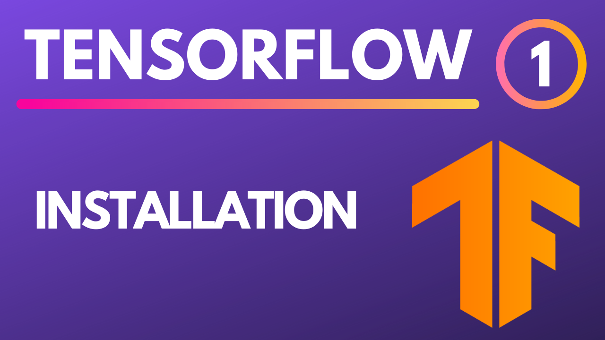

# learn-tensorflow

| # | Youtube | Code |
| - | - | - |
| All | Playlist of Course | |
| 0 | What is TensorFlow | |
| 1 | Installation | |
| 2 | GPU Installation   | |
| 3 | Tensor Basics | |
| 4 | Train Model | |
| 5 | Evaluations | |
| 6 | Metrics | |
| 6 | Convolutional Neural Networks | |
| 7 | Deployment | |
# Requirements
* Basic Python
* Linear Algebra
* Statistics

# Author
**Mert Cobanov** 

Data Scientist, AI Team Lead at Global AI Hub

Join or [Discord Group](https://discord.gg/s7yhCvTcvK)

Follow me on [Twitter](https://twitter.com/mertcobanov)

# Videos
## Installation
### Gpu Installation
## Tensor Basics
## Train Model
## Evaluation
## Metrics
